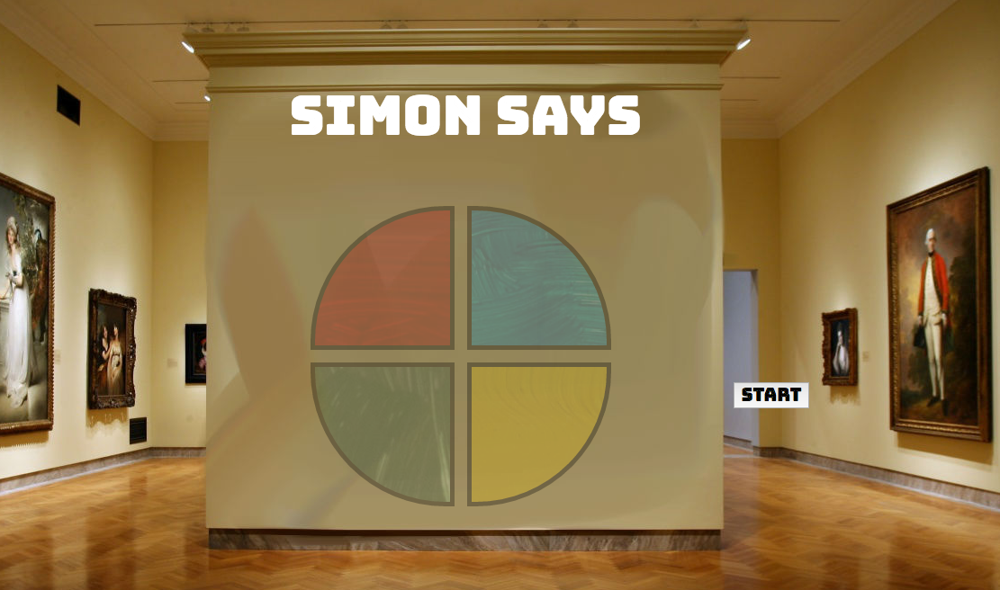

#Project 1

##Simon
Simon is a memory game where the player is tasked to memorize and repeat a sequence of actions performed by the computer. Traditionally, there will be 4 buttons, each identified by a different color, that will be part of the sequence. At the start, one action will be presented to the player. With each succesful action matched by the player, the computer repeats the sequence, adding a new move to the end of the sequence. The game is lost and reverted to the 1st round when the player fails to replicate the correct order.

##Technologies Used
HTML
 
CSS
 
JAVASCRIPT

##Getting Started
https://j562d.github.io/Project-1-Simon/

Click on the "Start" button to begin the game.
 
The Computer will play their sequence.
 
After their sequence is complete, try to repeat the same exact sequence by clicking on the boxes.
 
The game is over when you fail to replicate the correct sequence.
 
To replay the game, click on the "Start" button.

##Next Steps
Adding a high score feature.
 
Gradually increasing the sequence speed as the round increases.
